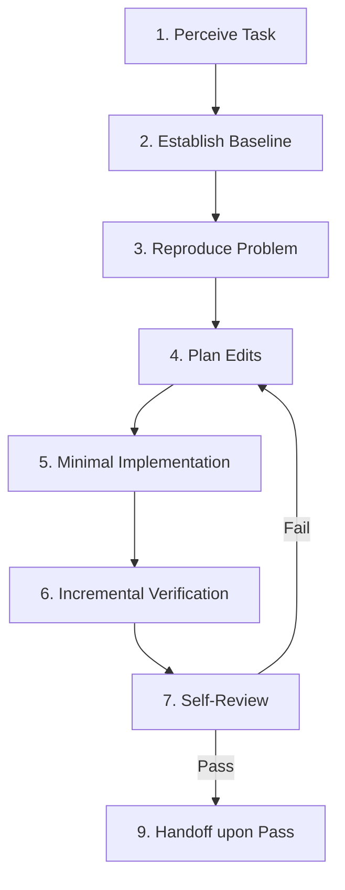

# neo-skills AGENTS.md

---

## 1. Project Overview

- **Primary Technology Stack**: `Node.js / JavaScript`
- **Coding & Architectural Conventions**:
  - Follow modular architecture and existing code formatting.
  - Inspect existing implementation files before creating new utilities.
  - Do NOT introduce unrequested third-party dependencies.

---

## 2. Commands

List exact command lines used for project development, testing, linting, typechecking, and building:

| Command Type | Exact Command Line | Purpose / Scope |
| :--- | :--- | :--- |
| **Unit / Integration Tests** | `npm test` | Verify behavioral correctness |
| **Skill Syntax Check** | `python3 scripts/check-skills-syntax.py` | Verify skill markdown and frontmatter syntax |
| **Build Check** | `npm run build` | Confirm clean compilation |

---

## 3. Workflow

The development workflow strictly follows this 9-stage closed loop:

1. **Perceive Task**: Read project guidelines (`AGENTS.md`) and target source files to understand goals and constraints.
2. **Establish Baseline**: Run existing test and build commands to confirm the project is in a stable, passing state.
3. **Reproduce Problem**: Write or run test cases/verification steps that reliably reproduce the issue or requirement.
4. **Plan Edits**: Decompose the task into small, atomic edit plans to avoid large single-turn changes.
5. **Minimal Implementation**: Apply minimal code changes while preserving existing comments and public API contracts.
6. **Incremental Verification**: Run local test, lint, and build commands immediately after each edit.
7. **Self-Review**: After an AI Agent finishes modifying code, tests, configuration, or scripts, activate `neo-code-review` and review the current uncommitted working tree with `--working-tree`. Inspect diffs and execution logs; if checks fail, read full un-truncated error logs to find the root cause.
8. **Remediate on Failure**: If verification or review finds a critical issue, the review scope is unclear, or the skill cannot be loaded, do not declare completion or hand off. Return to "Plan Edits / Minimal Implementation", then rerun verification and `neo-code-review` after each remediation.
9. **Handoff upon Pass**: Once all verification sensors pass, present a concise report with empirical proof for handoff.

---

## 4. Forbidden Antipattern Redlines

| Forbidden Action | Why It Is Prohibited | Required Behavior |
| :--- | :--- | :--- |
| **Silent Exception Swallowing** | Hides runtime failures and causes silent data corruption. | Let exceptions surface or handle explicitly with logging. |
| **Test Deletion / Suppression** | Forces builds to pass without fixing underlying bugs. | Fix root cause in source or update contract with justification. |
| **Hallucinated Signatures** | Invokes non-existent methods causing runtime crashes. | View symbol definition using search tools first. |
| **Unverified Completion Claim** | Misleads user regarding feature or bug state. | Run test/build commands and present log proof. |
