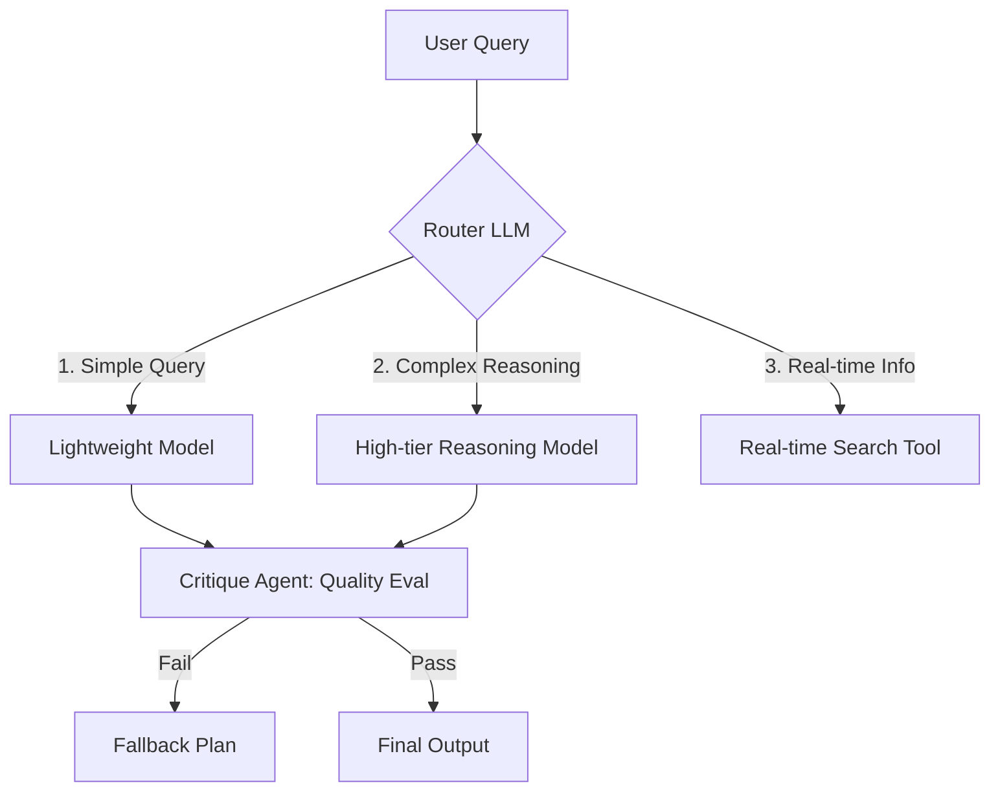
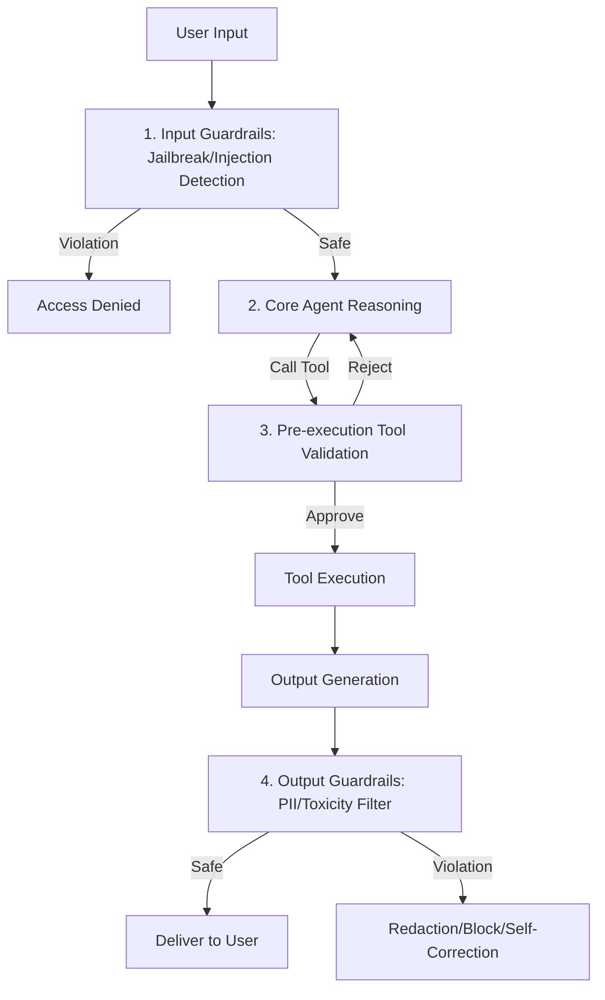
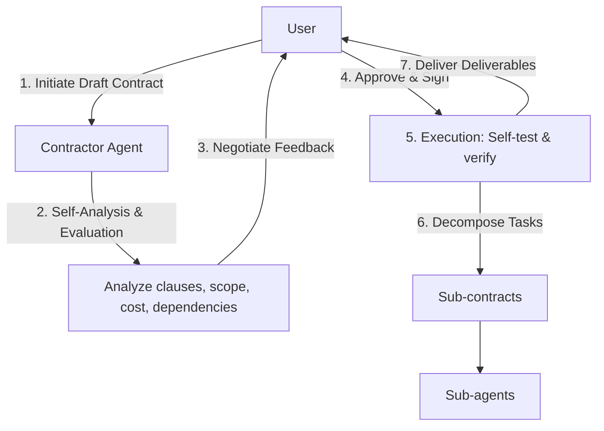
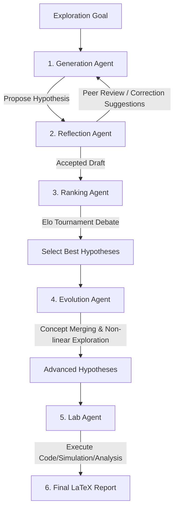

# Advanced Execution, Guardrails & Safety

This document provides conceptual designs for advanced execution, guardrails, and safety patterns, covering agent-to-agent (A2A) communication, resource-aware optimization, reasoning techniques, guardrails, evaluation and monitoring, prioritization, and scientific exploration.

---

## Chapter 15: Inter-Agent Communication (A2A)

### 1. Definition
An open agent communication protocol across frameworks and technology stacks. Uses standard HTTP and JSON-RPC formats to enable agent declaration, task delegation, and data exchange across different networks.

### 2. Core Components
* **Agent Card**: A JSON declaration containing the agent name, version, endpoint URL, multimodal capabilities, and skills.
* **Task Mechanism**: Defines collaboration as a "Task" with a lifecycle state (Submitted, Working, Completed, Failed), tracked using a `contextId` for multi-turn conversation context.
* **Communication Modes**:
  * **Synchronous**: Direct invocation with immediate response.
  * **Asynchronous Polling**: Submit a task to obtain a Task ID and periodically query status.
  * **Streaming (SSE)**: Receive partial outputs in real time via Server-Sent Events.
  * **Webhook**: Actively push notifications to a specified URL upon task completion.

### 3. Problems Addressed
* Heterogeneous framework silos: Solves communication barriers between different agent frameworks.
* Distributed collaboration barriers: Enables agents on different servers to safely delegate tasks.

---

## Chapter 16: Resource-Aware Optimization

### 1. Definition
Monitors computation, latency, and financial costs (tokens/API calls) in real time during agent execution. Dynamically switches between models with different capabilities or prunes context based on budget and latency constraints.

### 2. Problems Addressed
* API cost overruns: Avoids using expensive reasoning models for simple queries.
* Rate limits and overload: Executes fallbacks and backup plans when the primary model is limited or overloaded.

### 3. Workflow

---

## Chapter 17: Reasoning Techniques

### 1. Definition
Architectural techniques that allocate more computational resources at inference time to explicitly expand the agent's thought process. Covers step-by-step decomposition, tree-search path planning, code-assisted execution, and ReAct loops.

### 2. Six Core Reasoning Patterns
* **Chain of Thought (CoT)**: Guides the model to reason step-by-step to decompose complex problems.
* **Tree of Thoughts (ToT)**: Represents the reasoning space as a tree, supporting backtracking and multi-path parallel evaluation.
* **Reasoning and Action (ReAct)**: Interleaves tool execution with reasoning steps (Thought -> Action -> Observation -> Thought ... -> Finish).
* **Program-Aided Language Models (PALMs)**: Offloads precise mathematical calculations to a secure code sandbox and interprets the results to eliminate calculation hallucinations.
* **Multi-Agent Debate (Chain/Graph of Debates)**: Employs multiple agents to debate a problem across several turns, using consensus or strong logical conclusions as the final answer.
* **Scaling Inference Law**: Uses multi-path generation, self-correction, or extended thinking paths during the inference stage, allowing smaller models to achieve performance comparable to a single generation of a larger model.

---

## Chapter 18: Guardrails & Safety Patterns

### 1. Definition
Deploys multiple layers of filtering and defense at the input, tool execution, and output stages to ensure system compliance, safety, and protection against jailbreak attacks, prompt injection, and tool privilege escalation.

### 2. Multi-Layer Defense Flow

### 3. Problems Addressed
* Prompt jailbreaks: Prevents users from guiding the agent to perform unauthorized or harmful actions.
* Privilege escalation: Follows the principle of least privilege to prevent agents from unauthorized data modification or account deletion.

---

## Chapter 19: Evaluation and Monitoring

### 1. Definition
Systematically measures and audits agent execution quality, trajectories, resource consumption, and drift. Evaluates the execution trajectory rather than just the final answer for non-deterministic systems.

### 2. Three Core Evaluation Aspects
* **Objective Metrics Monitoring**: Logs latency, token consumption, and API success rates.
* **Trajectory Evaluation**: Compares action sequences with standard SOPs using exact matching, ordered matching, or unordered matching.
* **LLM-as-a-Judge**: Uses an independent LLM to score answers based on specific rubrics and outputs structured feedback.

### 3. Advanced Pattern: AI Contractor / Contract Pattern
Resolves prompt drift and responsibility ambiguity:

---

## Chapter 20: Prioritization

### 1. Definition
Sorts and dynamically schedules the execution order of multiple goals and tasks when the agent is faced with resource constraints or limited budgets.

### 2. Problems Addressed
* Deadlocks and lack of focus: Prevents delays in critical tasks caused by prioritizing minor ones.
* Inadequate crisis response: Ensures the agent can dynamically switch task context when high-priority events (e.g., safety alerts) occur.

### 3. Prioritization Metrics
* **Urgency**: Time sensitivity (closeness to deadline).
* **Importance**: Impact on accomplishing the ultimate goal.
* **Dependencies**: Whether the task is a prerequisite for other tasks.
* **Cost-Benefit Ratio**: Expected payoff relative to consumed resources.

### 4. Mechanism
Tasks are scored and entered into a Priority Queue, executed sequentially by the planner. The system recalculates weights and re-orders the queue (Dynamic Re-prioritization) or interrupts the current task when the environmental state changes.

---

## Chapter 21: Exploration and Discovery

### 1. Definition
Enables the agent to proactively explore unknown domains (Unknown Unknowns), generate new knowledge, design experiments, and prove hypotheses.

### 2. Multi-Agent Scientific Discovery Flow

### 3. Trade-offs
* **Pros**: Explores unknown topics autonomously, discovering insights that exceed human experience.
* **Cons**: High uncertainty and heavy token consumption; requires strict safety guardrails to prevent generating hazardous protocols.
