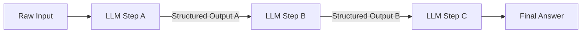
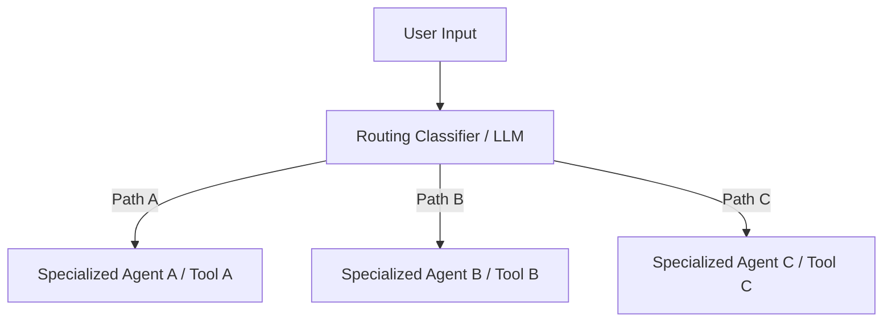
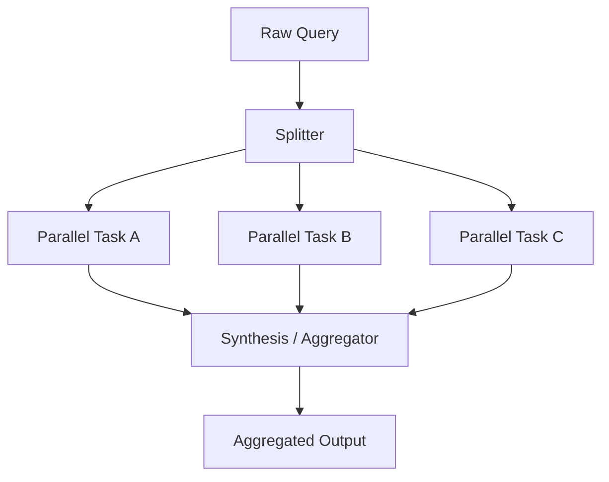
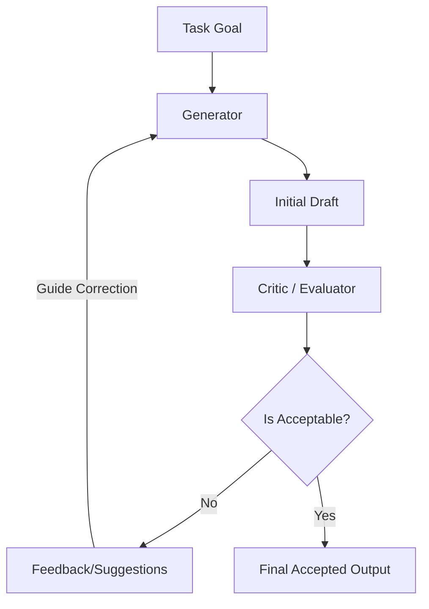
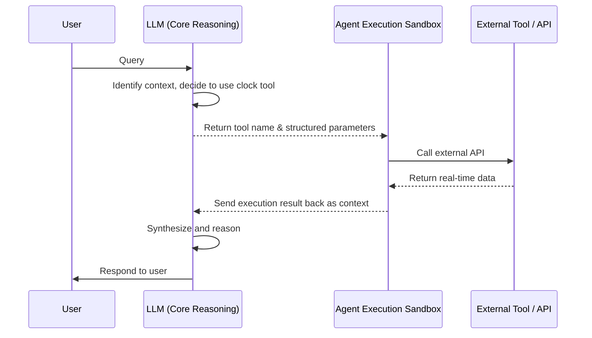
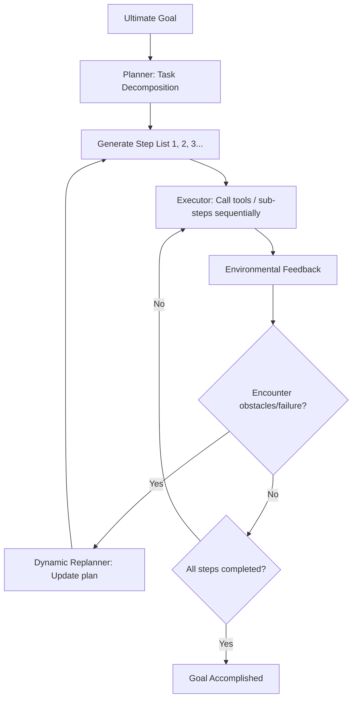

# Base Patterns & Workflows

This document provides conceptual designs for basic agentic orchestration patterns, covering prompt chaining, routing, parallelization, reflection, tool use, planning, and multi-agent collaboration.

---

## Chapter 1: Prompt Chaining

### 1. Definition
Decomposes a complex task into multiple **sequentially dependent subtasks**. The structured output of the previous step serves as the input for the next step. Each step focuses on a single, clear objective.

### 2. Problems Addressed
* Context dilution: Prevents the LLM from losing focus when processing large, complex tasks.
* Instruction drift: Avoids failures in a single prompt that contains too many rules.

### 3. Workflow

### 4. Trade-offs
* **Pros**: High predictability; easy to optimize prompts and perform unit testing for individual steps.
* **Cons**: High total latency due to sequential execution; errors in earlier steps propagate downstream (Error Cascade).

### 5. Use Cases
* Multi-step article generation (Outline -> Draft -> Polish -> Format).
* Data extraction and compliance analysis.

---

## Chapter 2: Routing

### 1. Definition
Dynamically redirects tasks to the most suitable execution path, specialized tool, or sub-agent based on input characteristics. Routing decisions are made by rule engines, semantic similarity, or LLM classifiers.

### 2. Problems Addressed
* Resource waste: Avoids using expensive, slow high-tier models for simple queries.
* Tool clutter: Avoids crowding too many unrelated tools into a single agent's context window.

### 3. Workflow

### 4. Trade-offs
* **Pros**: High modularity; reduces average system latency and token consumption.
* **Cons**: Routing errors directly cause downstream task failures; an extra routing decision layer adds minor latency.

### 5. Use Cases
* Customer support dispatching (e.g., routing to billing, tech support, or returns agents).
* Pre-filtering for tool calls.

---

## Chapter 3: Parallelization

### 1. Definition
Splits a large task into multiple **independent subtasks** executed in parallel (Fork) and aggregates the results at a single point (Join).

### 2. Problems Addressed
* Cumulative linear latency: Solves the high time cost associated with sequential multi-step execution.
* Single-perspective limitation: Collects diverse solutions to the same problem simultaneously for synthesis.

### 3. Workflow

### 4. Trade-offs
* **Pros**: Significantly reduces elapsed time; suitable for large-scale parallel filtering.
* **Cons**: High spikes in token usage, easily triggering API rate limits; reconciling inconsistent results requires additional algorithms or LLM overhead.

### 5. Use Cases
* Static code analysis (checking security, performance, and style simultaneously).
* Large-scale information retrieval and cross-document comparison.

---

## Chapter 4: Reflection (Self-Correction)

### 1. Definition
Introduces a dual-entity feedback mechanism: a Generator and a Critic. The Generator produces an initial draft, the Critic evaluates it for quality and provides feedback, and the Generator iteratively refines the output until termination conditions are met.

### 2. Problems Addressed
* Unstable output quality: Prevents logical gaps, factual errors, or formatting anomalies.
* Overconfidence: Breaks cognitive blind spots of a single-turn generation via an independent critique mechanism.

### 3. Workflow

### 4. Trade-offs
* **Pros**: Highly stable output quality, significantly reducing logical and formatting errors.
* **Cons**: Higher token consumption; extended execution time; potential for infinite loops if termination conditions are poorly defined.

### 5. Use Cases
* Automated code generation and testing (write code -> run tests -> fix based on errors -> re-test).
* Strict compliance document drafting.

---

## Chapter 5: Tool Use / Function Calling

### 1. Definition
The LLM reads the description format (schema) of external tools, autonomously decides when to call a tool and generates the parameters. The agent executes the tool in a sandbox or external system, and feeds the results back to the LLM for interpretation.

### 2. Problems Addressed
* Information lag: Connects the model to real-time data.
* Lack of computation: Solves difficulties in mathematics and precise logical operations.
* Inability to affect external systems: Allows agents to send emails, write databases, or call APIs.

### 3. Workflow

### 4. Trade-offs
* **Pros**: Greatly expands the action capabilities and data retrieval scope of the agent.
* **Cons**: Risk of parameter generation errors; security risks with external tools (requires strict sandboxing); vulnerability to external API instability.

### 5. Use Cases
* Real-time data queries (weather, stock market, ERP systems).
* Data entry and control (sending notifications, database updates).

---

## Chapter 6: Planning

### 1. Definition
Decomposes a high-level goal into an ordered set of dependent execution steps. The planner dynamically rewrites the remaining steps (replanning) based on environmental feedback and new information to ensure the goal is reached.

### 2. Problems Addressed
* Goal drift: Prevents the agent from losing sight of the ultimate goal during multi-step execution.
* Dynamic environment changes: Automatically searches for alternative solutions if a step fails.

### 3. Workflow

### 4. Trade-offs
* **Pros**: Highly adaptable; capable of autonomously handling complex, unstructured tasks.
* **Cons**: Very high cost in LLM calls for planning and replanning; plan errors propagate, drifting downstream actions away from the target.

### 5. Use Cases
* Autonomous research assistants (Deep Research: dynamically selecting keywords, assessing information quality, diving deep into unknown domains).
* Automated software development (architecture design -> module division -> sequential development).

---

## Chapter 7: Multi-Agent Collaboration

### 1. Definition
Distributes a large task among multiple **specialized agents with distinct personas and skills**. These agents coordinate task handoffs, discussions, and integration through a predefined collaboration topology.

### 2. Problems Addressed
* Cognitive limits of a single core: Avoids overloading a single system prompt with too many instructions and roles.
* Unclear division of labor: Emulates human teams by dedicating specialists to specific tasks.

### 3. Workflow
Four main collaboration topologies:
* **Handoffs (Network)**: Agent A finishes its task and hands over the context and control to Agent B.
* **Supervisor**: A central Supervisor agent coordinates, assigns tasks to specialists, and aggregates results.
* **Hierarchy**: Supervisors oversee sub-supervisors, delegating and aggregating tasks hierarchically.
* **Blackboard**: Agents read and write to a shared state space (blackboard), intervening autonomously as the state changes.

### 4. Trade-offs
* **Pros**: Modular and scalable; allows mixing different model sizes/strengths to optimize costs.
* **Cons**: High communication overhead (multi-turn dialogues between agents); complex state management; risk of infinite discussion loops or unclear ownership.

### 5. Use Cases
* Simulated software development teams (Product Manager -> Architect -> Engineer -> QA).
* Creative content generation and peer review.
