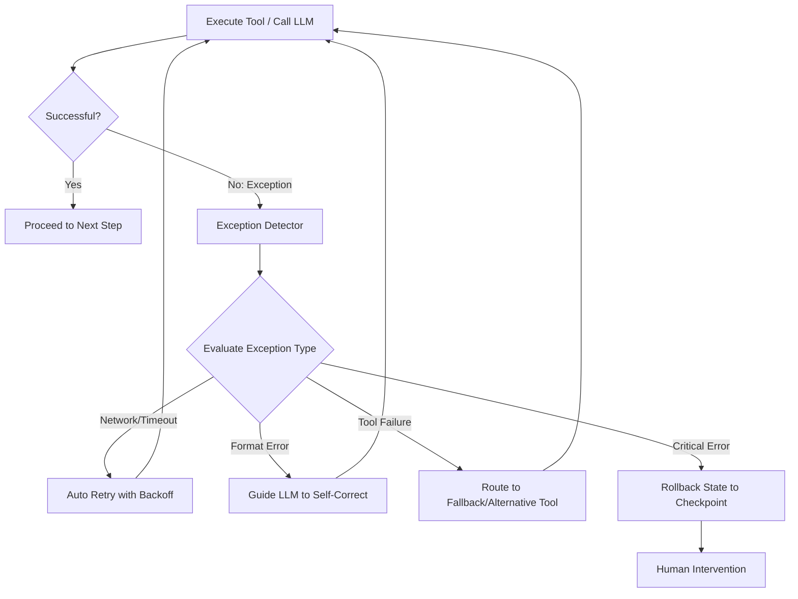
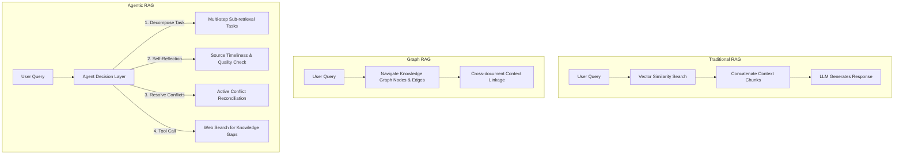

# Resilience, Exceptions & HITL

This document provides conceptual designs for system resilience, human interaction, and knowledge grounding, covering exception handling, Human-in-the-Loop (HITL) gates, and Retrieval-Augmented Generation (RAG).

---

## Chapter 12: Exception Handling and Recovery

### 1. Definition
Designs automatic detection, retry, fallback, and state rollback mechanisms for exceptions that may occur during agent execution (such as API timeouts, network disconnections, LLM format errors, and invalid tool parameters).

### 2. Problems Addressed
* System fragility: Prevents long-cycle workflows from breaking due to transient network or API issues.
* Format pollution: Guides the LLM to self-heal when its output does not conform to the expected JSON schema.

### 3. Workflow


### 4. Trade-offs
* **Pros**: Improves system robustness and reduces manual maintenance costs.
* **Cons**: Excessive retries or fallbacks can mask underlying bugs or quietly degrade output quality.

---

## Chapter 13: Human-in-the-Loop (HITL)

### 1. Definition
Strategically embeds human review, intervention, and authorization mechanisms into the agent's autonomous decision-making workflow, combining human common sense, ethics, and legal judgment with AI automation.

### 2. Problems Addressed
* High-risk operations: Prevents agent errors when performing large financial transactions, deleting sensitive data, or executing legally sensitive actions.
* Automation boundaries: Requests human guidance when decision confidence falls below a set threshold.

### 3. Three Core Interaction Modes
````carousel
### 1. Human-in-the-Loop (HITL)
* **Mechanism**: The agent pauses when reaching a high-risk step (e.g., large bank transfer), suspends the task, and sends it to a pending review queue.
* **Workflow**: Agent pauses -> Human reviews (Approve/Reject/Modify) -> Agent receives input and resumes execution.
* **Key Characteristic**: Human approval is a mandatory gate.
<!-- slide -->
### 2. Human-on-the-Loop (HOTL)
* **Mechanism**: The agent executes tasks autonomously while a human supervisor monitors and adjusts strategies.
* **Workflow**: Human sets macro rules (e.g., transaction limits) -> Agent trades automatically -> Human monitors metrics -> Human intervenes via a Kill Switch if necessary.
* **Key Characteristic**: Human does not intervene in individual decisions but maintains macro-level oversight.
<!-- slide -->
### 3. Decision Augmentation
* **Mechanism**: The agent acts as an analytical assistant, gathering data and presenting candidates. Decision-making and execution are performed entirely by a human.
* **Workflow**: Human asks query -> Agent collects and analyzes data -> Agent proposes options A, B, and C with pros/cons -> Human selects and executes.
* **Key Characteristic**: Agent provides cognitive augmentation without execution authority.
````

### 4. Trade-offs
* **Pros**: Provides a safety net and compliance guarantee for high-risk decisions; collects human feedback to optimize agent alignment.
* **Cons**: Human intervention limits system scalability and speed; designing human-in-the-loop review queues increases development costs.

---

## Chapter 14: Knowledge Retrieval / RAG

### 1. Definition
Retrieves relevant information from a knowledge base before the LLM generates a response, injecting the retrieved text chunks into the prompt context to guide the LLM toward producing factually grounded answers.

### 2. Advanced Agentic RAG Variants


### 3. Problems Addressed
* Outdated knowledge: Bypasses the temporal limits of static training data.
* Hallucination: Restricts the model within factual boundaries using verified document contexts.
* Fragmented information: Resolves vector search limitations that struggle to answer comprehensive questions spanning multiple documents.

### 4. Trade-offs
* **Pros**: Minimizes factual errors; supports precise citations; imports private knowledge without retraining models.
* **Cons**: Highly sensitive to the quality of text chunking and embeddings; multi-step reasoning in Agentic RAG increases response latency.
