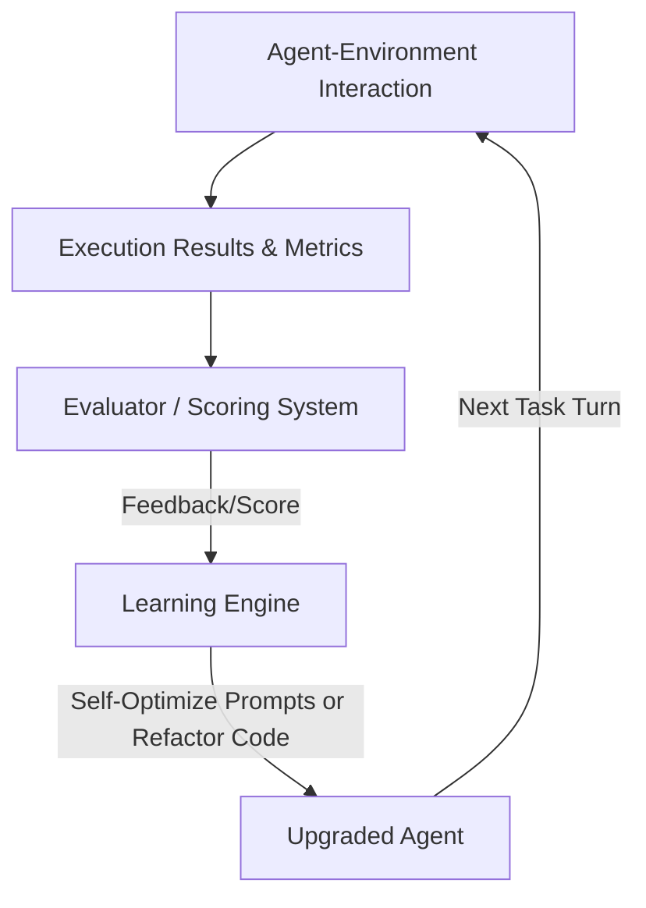
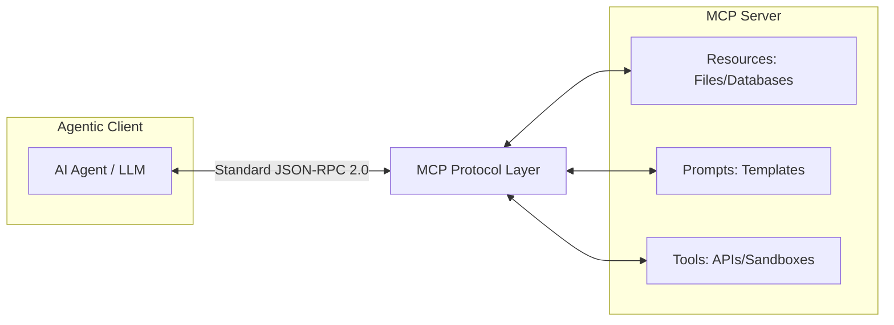

# System Components & Protocols

This document provides conceptual designs for system architecture components, resources, and protocols, covering memory management, learning and adaptation, Model Context Protocol (MCP), and goal setting and monitoring.

---

## Chapter 8: Memory Management

### 1. Definition
Provides agents with the ability to store and retrieve information across sessions and tasks through persistence mechanisms. The memory system is generally divided into short-term and long-term memory, managed by a unified Memory Service.

### 2. Memory Classification
| Memory Type | Medium | Function | Eviction & Retrieval Mechanism |
| :--- | :--- | :--- | :--- |
| **Short-term** | Current Context Window | Stores current conversation context and task execution trajectory | Sliding window, context pruning, and summarization |
| **Long-term Semantic** | Vector Database / Knowledge Base | Retains factual knowledge, concepts, and external rules | Vector semantic retrieval based on user input |
| **Long-term Episodic** | Structured Database / Log Store | Records past task execution experiences and outcomes | Used for few-shot learning or similar scenario matching |
| **Long-term Procedural**| Codebase / Tool Definitions / Prompt Templates | Records Standard Operating Procedures (SOPs) and toolbox definitions for specific tasks | Dynamically loaded based on task type |

### 3. Problems Addressed
* Amnesia (Context limits): Prevents long conversations from causing the LLM to lose critical history.
* Repeated errors: Ensures the agent learns from past executions to improve decision success rates.

---

## Chapter 9: Learning and Adaptation

### 1. Definition
Enables the agent to autonomously modify prompts or self-modify execution code in a code sandbox (SICA - Self-Improving Coding Agent) by collecting behavioral feedback and rewards from interactions with the environment, users, or other agents.

### 2. Problems Addressed
* Static configuration lag: Solves the issue of agents failing to adjust when environmental rules change.
* High development cost: Eliminates the manual process of fine-tuning prompts.

### 3. Workflow

### 4. Trade-offs
* **Pros**: High potential for long-term self-evolution; can discover high-quality logic not designed by humans in specific vertical disciplines (e.g., mathematical proofs, code generation).
* **Cons**: Unpredictable evolution paths, which may generate harmful mutations; self-modifying prompts can lead to privilege escalation or security vulnerabilities; extremely high overhead for training and testing iterations.

---

## Chapter 10: Model Context Protocol (MCP)

### 1. Definition
A standardized **Client-Server communication protocol** that establishes a plug-and-play integration standard between LLMs/Agents (Clients) and external data sources, development tools, and API services (Servers). MCP standardizes three core types of context exchange: **Resources**, **Prompts**, and **Tools**.

### 2. Problems Addressed
* Tedious integration: Avoids repeatedly writing custom wrapper code when developing new agents or integrating new tools.
* Fragmented context acquisition: Provides external data and actions to the model in a unified interface format.

### 3. Trade-offs
* **Pros**: Reduces integration costs for multiple tools and data sources; decouples data sources from reasoning entities; supports dynamic discovery.
* **Cons**: Protocol serialization and JSON-RPC wrapping introduce minor performance overhead; requires tool providers to actively adopt the protocol.

---

## Chapter 11: Goal Setting and Monitoring

### 1. Definition
Sets structured and quantifiable goals (SMART principles) before agent initialization, and introduces an independent monitor during the execution phase to observe progress in real time (Progress Checkpoints), detect blocks, and trigger human-agent collaboration escalation when necessary.

### 2. Problems Addressed
* Blind execution: Prevents agents from entering infinite retry loops when encountering logical obstacles, wasting budget.
* Lack of observability: Solves the black-box execution problem, providing a clear progress path.

### 3. Use Cases
* Automated marketing campaign execution.
* Long-cycle autonomous codebase refactoring.
