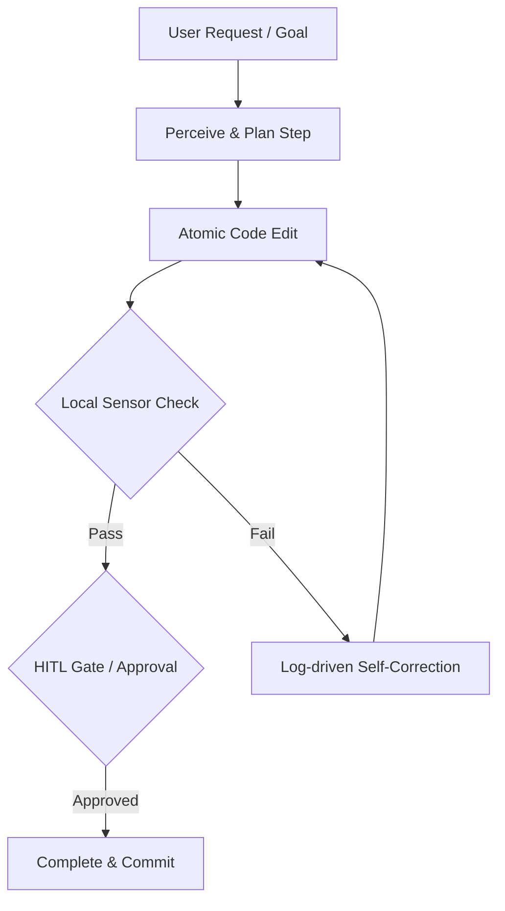

# LLM Orchestration Patterns & Topology Design

This reference synthesizes LLM agent orchestration architectures and safety guardrails from `neo-agentic-design`.

## Core Orchestration Patterns

### 1. Prompt Chaining
Decompose complex tasks into sequential, dependent sub-tasks. Output of Step A feeds into Step B.

### 2. Routing
Dynamically route requests to specialized sub-agents or tools based on classification or semantic input.

### 3. Parallelization
Run independent sub-tasks concurrently (e.g., section generation or multi-perspective reviews) and synthesize results.

### 4. Reflection & Self-Correction
Evaluate generated output against quality criteria or test feedback, then iterate.
> [!WARNING]
> Always enforce a maximum iteration limit (3–5 cycles) to prevent infinite loops.

### 5. Human-in-the-Loop (HITL) Gates
Insert explicit review checkpoints for high-risk operations (e.g., database schema migrations, external API calls, financial actions).

---

## Standard Topology Diagram (Mermaid)

When documenting an Agent workflow in `AGENTS.md`, include a concise Mermaid topology:

---

## Context Window Guardrails

1. **Context Pruning Protection**: Protect system prompts, project rules, and active task state from being pruned during context compaction.
2. **Size Enforcement**: Keep project instruction files (like `AGENTS.md`) under 32 KiB (32,768 bytes) to preserve prompt headroom.
